# گزارش همگام سازی محصول: راهنمای جامع

# گزارش همگام سازی محصول: راهنمای جامع

## فهرست مطالب
1. [دسترسی به گزارش همگام‌سازی محصول](#1-دسترسی-به-گزارش-همگام-سازی-محصول)
2. [پنل جستجو](#2-پنل-جستجو)
3. [پنل مدیریت کاربران](#3-پنل-مدیریت-کاربران)
4. [سفارشی کردن لاگ‌ها](#4-سفارشی-کردن-لاگ-ها)
5. [پنل تنظیمات نمایش](#5-پنل-تنظیمات-نمایش)
6. [اطلاعات افزونه](#6-اطلاعات-افزونه)
7. [پنل عیب‌یابی](#7-پنل-عیب-یابی)
8. [جعبه متای همگام‌سازی محصول](#8-جعبه-متای-همگام-سازی-محصول)

## 1. دسترسی به گزارش همگام‌ سازی محصول
### مکان قرارگیری:
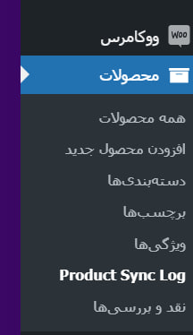
منوی محصولات در نوار کناری مدیریت وردپرس قرار دارد که معمولاً با نماد پوشه ای با عنوان "محصولات" نشان داده می شود.مستقیماً در زیر آیتم منوی اصلی ووکامرس قرار دارد.
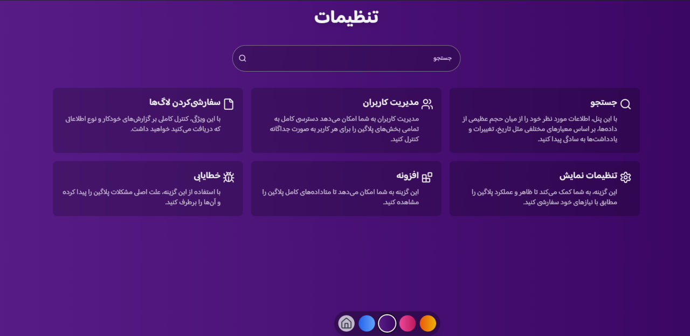

### دسترسی به گزارش همگام‌سازی محصول:
1. نشانگر را روی منوی "محصولات" در نوار کناری نگه دارید.
2. در منوی فرعی که ظاهر می شود به دنبال "Doorbin" بگردید.
3. برای دسترسی به این پانل باید مجوز "تغییر تنظیمات" را داشته باشید

### منوی پایین:
- انتخابگر تم: نقطه هایی برای انتخاب تم رنگی رابط.
- آیکون صفحه اصلی:به صفحه اصلی تنظیمات باز می گردد.

## 2. پنل جستجو
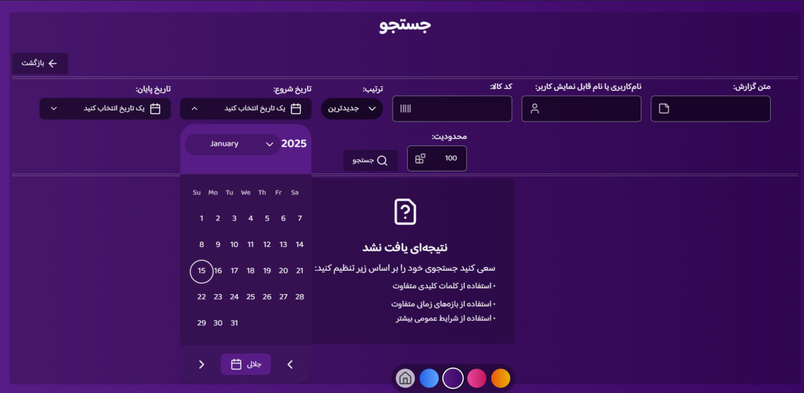

### بررسی اجمالی 
با این پنل، اطلاعات مورد نظر خود را از میان حجم عظیمی از داده‌ها، بر اساس معیارهای مختلفی مثل تاریخ، تغییرات و یادداشت‌ها به سادگی پیدا کنید.

### هشدار مهم:
- برای دسترسی به این پنل باید مجوز "جستجو" داشته باشید
- برای حذف لاگ‌ها باید مجوز "حذف" داشته باشید
- نتایج جستجوی با حجم زیاد ممکن است برای حفظ عملکرد توسط تنظیمات سیستم محدود شوند
- بازه‌های تاریخ باید در دوره نگهداری لاگ باشند

### دسترسی به پنل
- در رابط کاربری افزونه لاگ همگام‌سازی محصول قرار دارد
- دکمه "بازگشت" برای برگشت به صفحه قبلی در دسترس است
- عنوان "جستجو" در مرکز نشان‌دهنده موقعیت فعلی است

#### فیلدهای معیار جستجو
1. متن لاگ
   - جستجوی متن در محتوای لاگ
   - پشتیبانی از تطبیق متن جزئی
   - جستجوی غیرحساس به حروف کوچک و بزرگ

2. شناسایی کاربر
   - جستجو بر اساس نام کاربری یا نام نمایشی
   - پشتیبانی از تطبیق نام جزئی
   - تطبیق با پایگاه داده کاربران

3. اطلاعات محصول
   - فیلد جستجوی شماره/شناسه محصول
   - پشتیبانی از تطبیق دقیق و جزئی
   - پیوند به جزئیات محصول

4. کنترل‌های زمان و ترتیب
   - انتخاب بازه تاریخ (تاریخ شروع/پایان)
   - پشتیبانی از چندین فرمت (تقویم جلالی و شمسی)
   - انتخاب ترتیب (جدیدترین/قدیمی‌ترین اول)

5. محدودیت نتایج
   - ورودی عددی برای حداکثر نتایج
   - مقدار پیش‌فرض: 100 ورودی
   - قابل تنظیم بر اساس نیازها

### نمایش نتایج
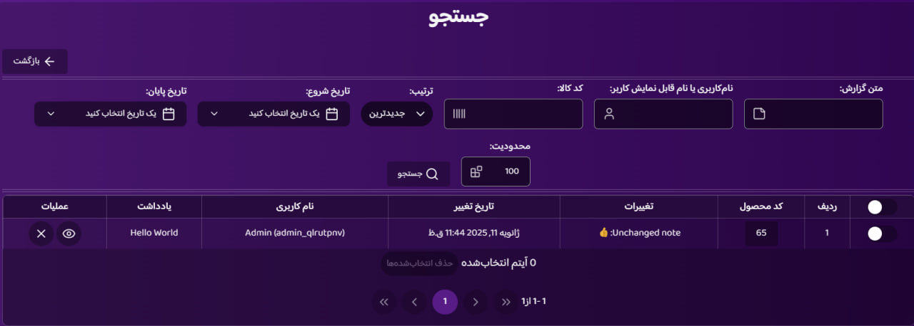

#### ساختار جدول
1. بخش سرصفحه
   - چک‌باکس انتخاب گروهی
   - کنترل‌های عملیات

2. ستون‌های داده
   - چک‌باکس انتخاب
   - شماره ردیف
   - کد محصول (قابل کلیک)
   - تغییرات (مقادیر قبلی/جدید)
   - تاریخ اصلاح
   - نام کاربری
   - یادداشت‌
   - دکمه‌های عملیات

3. بخش پاورقی
   - کنترل‌های صفحه‌بندی
   - نمایش تعداد نتایج
   - کنترل‌های عملیات گروهی

### ویژگی‌های تعاملی

#### عملیات ردیف
1. گزینه‌های انتخاب
   - انتخاب ردیف تکی
   - تغییر وضعیت انتخاب گروهی
   - انتخاب چند ردیف

2. پیوندهای محصول
   - کلیک برای باز کردن ویرایشگر محصول
   - ناوبری در تب جدید
   - پیش‌نمایش هنگام هاور در دسترس است
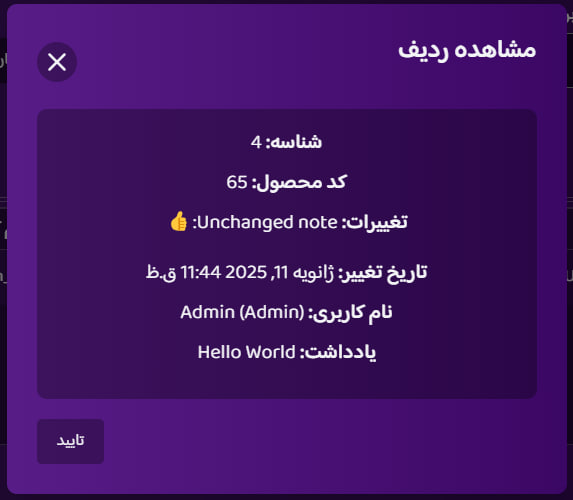
3. نمایش کامل جزئیات
   - پنجره محاوره ای برای نمایش جزئیات کامل
   - اطلاعات کامل تغییرات
   - داده‌های کامل ورودی لاگ

### مدیریت داده‌ها

#### کنترل‌های حذف
1. حذف تکی
   - دکمه حذف برای هر ردیف
   - نیاز به تایید
   - دسترسی بر اساس مجوز

2. حذف گروهی
   - انتخاب چند ردیف
   - پردازش دسته‌ای
   - تاییدیه‌های ایمنی

### کارایی
1. جستجوی کارآمد
   - استفاده از حداقل معیارهای لازم
   - ترکیب فیلدها برای دقت
   - پاک کردن فیلترهای استفاده نشده
2. مدیریت نتایج
   - بررسی نتایج قبل از عملیات گروهی
   - تایید حذف‌ها با دقت
   - خروجی گرفتن از داده‌های مهم قبل از حذف

3. نکات عملکرد
   - محدود کردن بازه‌های تاریخ در صورت امکان
   - استفاده از معیارهای خاص برای مجموعه داده‌های بزرگ
   - تنظیم مناسب محدودیت‌های نتایج

### عیب‌یابی
1. نتیجه‌ای یافت نشد
   - معیارهای جستجو را گسترده‌تر کنید
   - اعتبار بازه تاریخ را بررسی کنید
   - مجوزهای جستجو را تایید کنید

2. مشکلات عملکرد
   - محدودیت نتایج را کاهش دهید
   - بازه تاریخ را محدود کنید
   - معیارهای جستجوی بیشتری مشخص کنید
## 3. پنل مدیریت کاربران
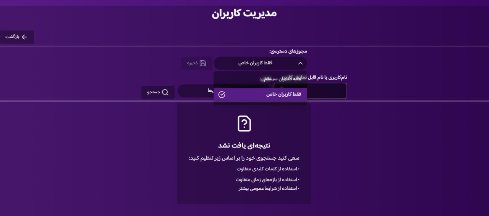

### کارایی
مدیریت کاربران به شما امکان می‌دهد دسترسی کامل به تمامی بخش‌های پلاگین را برای هر کاربر به صورت جداگانه کنترل کنید.

### هشدار مهم:
- برای دسترسی به این پنل باید مجوز "مدیریت کاربران" داشته باشید
- هنگام اختصاص مجوزها احتیاط کنید، زیرا مستقیماً بر امنیت و عملکرد افزونه تأثیر می‌گذارند

### دسترسی به پنل
- در تنظیمات افزونه لاگ همگام‌سازی محصول قرار دارد
- دکمه "بازگشت" شما را به صفحه اصلی تنظیمات لاگ همگام‌سازی محصول برمی‌گرداند

### کنترل‌های مجوز دسترسی

#### حالت‌های مجوز
1. همه مدیران سیستم
   - مجوزهای کامل به تمام کاربران مدیر
   - فقط برای کارکنان سطح مدیر مورد اعتماد توصیه می‌شود

2. فقط کاربران سفارشی
   - امکان حقوق دسترسی بسیار سفارشی
   - اجازه فیلتر کردن کاربر و تخصیص مجوز سفارشی

### قابلیت جستجوی کاربر
- جستجو بر اساس نام کاربری یا نام نمایشی (نیاز به تایپ کامل نیست)
- فیلتر بر اساس نقش (به استثنای نقش مشتری)
- نقش‌های موجود شامل:
  - مدیر
  - نویسنده
  - مدیر فروشگاه
  - سایر نقش‌های وردپرس

### اجزای اصلی رابط کاربری

#### ساختار جدول
1. بخش سرصفحه
   - انتخاب همه ردیف‌ها
   - شماره‌گذاری ردیف
   - ستون نام کاربری
   - ستون نقش اصلی
   - ستون نقش‌ها
   - ستون مجوزهای دسترسی
   - ستون عملیات

2. ردیف‌های داده
   - قابل انتخاب برای عملیات گروهی
   - متن کوتاه شده نمایش کامل هنگام هاور/کلیک
   - دکمه‌های مشاهده و ویرایش مجوز برای هر ردیف

3. بخش پاورقی
   - گزینه به‌روزرسانی مجوز گروهی
   - کنترل‌های صفحه‌بندی
   - نمایش اطلاعات صفحه

### مدیریت مجورها

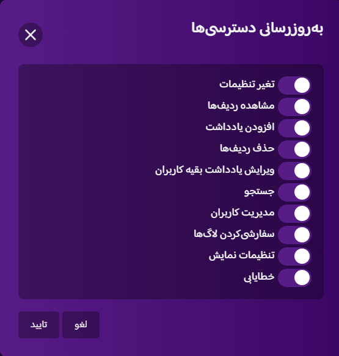

#### مجوزهای موجود
1. تغییر تنظیمات
   - دسترسی به صفحه پیکربندی افزونه

2. مشاهده ردیف‌ها
   - توانایی مشاهده لاگ‌ها در متاباکس

3. افزودن یادداشت
   - مجوز افزودن یادداشت به تغییرات

4. حذف ردیف‌ها
    - اجازه حذف گزارش‌ها

5. ویرایش یادداشت‌های سایر کاربران
    - توانایی اصلاح یادداشت‌های ایجاد شده توسط سایر کاربران

6. جستجو
    - دسترسی به قابلیت جستجو

7. مدیریت کاربران
    - دسترسی به کنترل‌های مجوز کاربران

8. سفارشی‌سازی گزارش
    - توانایی تغییر نمایش و رفتار گزارش‌ها

9. تنظیمات نمایش
    - کنترل ترجیحات ثبت پایگاه داده

10. عیب‌یابی
    - دسترسی به گزارش‌های خطا و قابلیت‌های حذف

### مدیریت مجوزها

#### به‌روزرسانی کاربر فردی
1. روی آیکون ویرایش کلیک کنید (آیکون ویرایش کاربر)
2. مجوزها را در کادر گفتگو تغییر دهید
3. تغییرات را با "تأیید" تأیید کنید
4. تغییرات را با دکمه اصلی ذخیره کنید

#### به‌روزرسانی‌های گروهی
1. کاربران مورد نظر را با استفاده از چک‌باکس‌ها انتخاب کنید
2. روی "به‌روزرسانی مجوزها" کلیک کنید
3. مجوزها را به صورت گروهی تغییر دهید
4. تغییرات را ذخیره کنید

### پیمایش
- کنترل‌های صفحه‌بندی برای صفحات متعدد
- نمایش تعداد صفحه و کل موارد
- دسترسی سریع به صفحه اول/آخر
- پیمایش صفحه قبلی/بعدی

###  بهترین عملکرد
1. بررسی منظم مجوزهای کاربران
2. محدود کردن مجوزهای سطح بالا به کاربران مورد اعتماد
3. آزمایش دسترسی پس از به‌روزرسانی‌ها
4. حفظ اصل حداقل دسترسی

## 4. سفارشی کردن لاگ ها

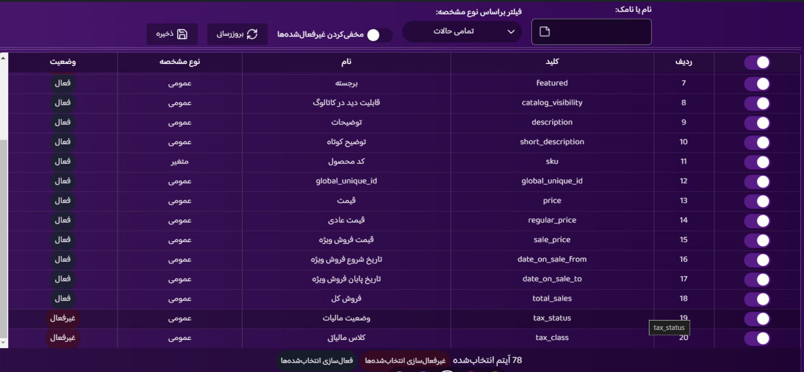

### کارایی
با این ویژگی، کنترل کاملی بر گزارش‌های خودکار و نوع اطلاعاتی که دریافت می‌کنید خواهید داشت.

### هشدار مهم:
- برای دسترسی به این پنل باید مجوز "سفارشی سازی گزارش‌ها" را داشته باشید
- توجه داشته باشید که برخی از ویژگی‌ها به صورت پیش‌فرض غیرفعال هستند
- هنگام غیرفعال کردن ویژگی‌های گزارش احتیاط کنید

### دسترسی به پنل
پنل سفارشی کردن لاگ‌ها از طریق زیر قابل دسترسی است:
1. تنظیمات افزونه Doorbin
2. از دکمه "بازگشت" برای برگشت به تنظیمات اصلی Doorbin استفاده کنید

### ویژگی‌های کنترلی

#### کنترل‌های فیلتر
- فیلتر نام/اسلاگ: به صورت آنی ویژگی‌های حاوی نام یا اسلاگ وارد شده را فیلتر می‌کند
- فیلتر نوع ویژگی:
  - همه ویژگی‌ها: تمام ویژگی‌های محصول را نمایش می‌دهد
  - عمومی: فقط ویژگی‌های عمومی محصول را نمایش می‌دهد
  - ویژگی: فقط ویژگی‌های خاص محصول را نمایش می‌دهد
  - متغیر: فقط ویژگی‌های متغیر محصول را نمایش می‌دهد
- پنهان کردن غیرفعال‌ها: تغییر وضعیت برای پنهان کردن ویژگی‌های غیرفعال
- بازخوانی: به‌روزرسانی لیست ویژگی‌های محصول ووکامرس
- ذخیره: اعمال تمام تغییرات در تنظیمات

### رابط جدول

#### بخش هدر
- چک باکس برای عملیات‌های دسته‌ای
- کلید: شناسه ویژگی
- نام: نام ویژگی
- نوع ویژگی: دسته‌بندی (عمومی | ویژگی | متغیر)
- وضعیت: نشانگر فعال/غیرفعال

#### سطرهای داده
- چک‌باکس‌های انتخاب انفرادی برای عملیات‌های دسته‌ای
- محتوای متنی قابل گسترش (برای مشاهده متن کامل روی آن هاور/کلیک کنید)

#### کنترل‌های پاورقی
- عملیات‌های دسته‌ای:
  - "غیرفعال‌سازی انتخاب‌شده‌ها": به طور موقت ویژگی‌های انتخاب شده را غیرفعال می‌کند
  - "فعال‌سازی انتخاب‌شده‌ها": به طور موقت ویژگی‌های انتخاب شده را فعال می‌کند
  - نکته: تغییرات برای دائمی شدن نیاز به ذخیره‌سازی دارند
- ناوبری صفحه‌بندی
- نمایش اطلاعات صفحه

### بهترین شیوه‌های کار
1. قبل از ذخیره‌سازی، تغییرات را بررسی کنید
2. برای مدیریت کارآمد از عملیات‌های دسته‌ای استفاده کنید
3. به طور منظم ویژگی‌های فعال را اعتبارسنجی کنید
4. تعادل بین ثبت جامع لاگ‌ها و عملکرد سیستم را حفظ کنید

### نکات
- تمام تغییرات تا زمان ذخیره‌سازی موقتی هستند
- برای اطمینان از کار با داده‌های جاری از دکمه بازخوانی استفاده کنید
- هنگام غیرفعال کردن ویژگی‌ها، تأثیر آن بر تولید گزارش را در نظر بگیرید

## 5. پنل تنظیمات نمایش

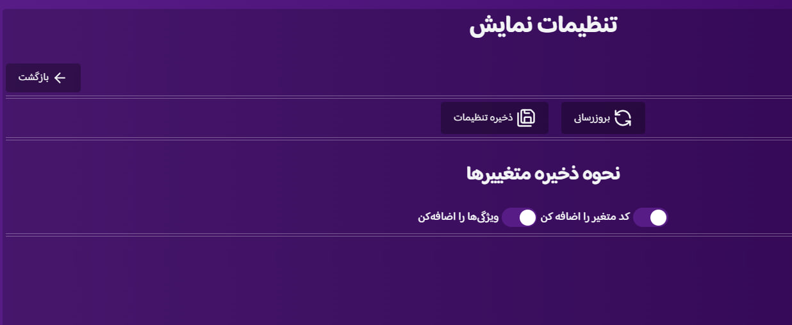

### نمای کلی
پنل تنظیمات نمایش امکان سفارشی‌سازی ظاهر افزونه و رفتار ذخیره‌سازی داده‌ها را فراهم می‌کند. این پنل کنترل‌هایی برای نحوه ذخیره‌سازی و نمایش داده‌های محصول متغیر در سیستم ارائه می‌دهد.

### هشدار مهم:
- برای دسترسی به این پنل باید مجوز "تنظیمات نمایش" را داشته باشید
- تغییرات اعمال شده در اینجا بر نحوه ذخیره‌سازی و بازگرداندن داده‌های محصول تأثیر می‌گذارد

### دسترسی به پنل
پنل سفارشی کردن لاگ‌ها از طریق زیر قابل دسترسی است:
1. تنظیمات افزونه Doorbin
2. از دکمه "بازگشت" برای برگشت به تنظیمات اصلی Doorbin استفاده کنید

### هشدار مهم:
- برای دسترسی به این پنل باید مجوز "سفارشی سازی گزارش‌ها" را داشته باشید
- توجه داشته باشید که برخی از ویژگی‌ها به صورت پیش‌فرض غیرفعال هستند
- هنگام غیرفعال کردن ویژگی‌های گزارش احتیاط کنید

### دسترسی به پنل
پنل سفارشی کردن لاگ‌ها از طریق زیر قابل دسترسی است:
1. تنظیمات افزونه Doorbin
2. از دکمه "بازگشت" برای برگشت به تنظیمات اصلی Doorbin استفاده کنید

### ویژگی‌های کنترلی

#### کنترل‌های فیلتر
- فیلتر نام/اسلاگ: به صورت آنی ویژگی‌های حاوی نام یا اسلاگ وارد شده را فیلتر می‌کند
- فیلتر نوع ویژگی:
  - همه ویژگی‌ها: تمام ویژگی‌های محصول را نمایش می‌دهد
  - عمومی: فقط ویژگی‌های عمومی محصول را نمایش می‌دهد
  - ویژگی: فقط ویژگی‌های خاص محصول را نمایش می‌دهد
  - متغیر: فقط ویژگی‌های متغیر محصول را نمایش می‌دهد
- پنهان کردن غیرفعال‌ها: تغییر وضعیت برای پنهان کردن ویژگی‌های غیرفعال
- بازخوانی: به‌روزرسانی لیست ویژگی‌های محصول ووکامرس
- ذخیره: اعمال تمام تغییرات در تنظیمات

### رابط جدول

#### بخش هدر
- کلید انتخاب سراسری برای عملیات‌های دسته‌ای
- کلید: شناسه ویژگی
- نام: نام ویژگی
- نوع ویژگی: دسته‌بندی (عمومی | ویژگی | متغیر)
- وضعیت: نشانگر فعال/غیرفعال

#### سطرهای داده
- چک‌باکس‌های انتخاب انفرادی برای عملیات‌های دسته‌ای
- محتوای متنی قابل گسترش (برای مشاهده متن کامل روی آن هاور/کلیک کنید)

#### کنترل‌های پاورقی
- عملیات‌های دسته‌ای:
  - "غیرفعال‌سازی انتخاب‌شده‌ها": به طور موقت ویژگی‌های انتخاب شده را غیرفعال می‌کند
  - "فعال‌سازی انتخاب‌شده‌ها": به طور موقت ویژگی‌های انتخاب شده را فعال می‌کند
  - نکته: تغییرات برای دائمی شدن نیاز به ذخیره‌سازی دارند
- ناوبری صفحه‌بندی
- نمایش اطلاعات صفحه

### بهترین شیوه‌های کار
1. قبل از ذخیره‌سازی، تغییرات را بررسی کنید
2. برای مدیریت کارآمد از عملیات‌های دسته‌ای استفاده کنید
3. به طور منظم ویژگی‌های فعال را اعتبارسنجی کنید
4. تعادل بین ثبت جامع لاگ‌ها و عملکرد سیستم را حفظ کنید

### نکات
- تمام تغییرات تا زمان ذخیره‌سازی موقتی هستند
- برای اطمینان از کار با داده‌های جاری از دکمه بازخوانی استفاده کنید
- هنگام غیرفعال کردن ویژگی‌ها، تأثیر آن بر تولید گزارش را در نظر بگیرید

## 5. پنل تنظیمات نمایش

### نمای کلی
پنل تنظیمات نمایش امکان سفارشی‌سازی ظاهر افزونه و رفتار ذخیره‌سازی داده‌ها را فراهم می‌کند. این پنل کنترل‌هایی برای نحوه ذخیره‌سازی و نمایش داده‌های محصول متغیر در سیستم ارائه می‌دهد.

### هشدار مهم:
- برای دسترسی به این پنل باید مجوز "تنظیمات نمایش" را داشته باشید
- تغییرات اعمال شده در اینجا بر نحوه ذخیره‌سازی و بازگرداندن داده‌های محصول تأثیر می‌گذارد

### دسترسی به پنل
پنل تنظیمات نمایش از طریق زیر قابل دسترسی است:
1. تنظیمات افزونه Doorbin
2. از دکمه "بازگشت" برای برگشت به تنظیمات اصلی Doorbin استفاده کنید

### ویژگی‌های کنترلی

#### کنترل‌های اصلی
- بازخوانی: به‌روزرسانی لیست تنظیمات موجود
- ذخیره تنظیمات: اعمال تمام تغییرات در سیستم

#### روش ذخیره‌سازی متغیر

##### تنظیمات کد متغیر
- شامل کردن کد متغیر
  - در صورت فعال بودن: کد متغیر را پس از تغییرات در محصولات متغیر اضافه می‌کند
  - مثال قالب: (کد متغیر:1345)
  - نکته: اگر شامل کردن ویژگی‌ها غیرفعال باشد، کد متغیر به صورت پیش‌فرض شامل می‌شود

##### تنظیمات نمایش ویژگی
- شامل کردن ویژگی‌ها
  - در صورت فعال بودن: ویژگی‌های محصول متغیر را در لاگ شامل می‌کند
  - ویژگی‌هایی مانند رنگ، سایز را نمایش می‌دهد
  - مثال قالب: (سایز:XL => رنگ:سبز)

### بهترین شیوه‌های کارایی
1. پس از به‌روزرسانی‌ها، تنظیمات را برای اطمینان از رفتار مورد نظر بررسی کنید
2. پس از اعمال تغییرات، ثبت لاگ محصول متغیر را آزمایش کنید
3. هنگام پیکربندی نمایش ویژگی‌ها، خوانایی داده‌ها را در نظر بگیرید
4. تنظیمات یکسان را در انواع محصولات مشابه حفظ کنید

### نکات
- تمام تغییرات برای اعمال شدن نیاز به ذخیره‌سازی دارند
- شامل کردن کد متغیر ممکن است بر خوانایی لاگ تأثیر بگذارد
- هنگام پیکربندی نمایش ویژگی‌ها، تعادل بین جزئیات و وضوح را در نظر بگیرید

## 6. اطلاعات افزونه

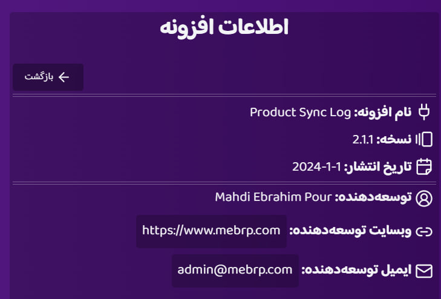

### نمای کلی
این گزینه به شما امکان می‌دهد متادیتای کامل افزونه را مشاهده کنید.

### دسترسی به پنل
پنل تنظیمات نمایش از طریق زیر قابل دسترسی است:
1. تنظیمات افزونه Doorbin
2. از دکمه "بازگشت" برای برگشت به تنظیمات اصلی Doorbin استفاده کنید

### اطلاعات اصلی
- نام افزونه: Doorbin
- نسخه: نسخه افزونه
- تاریخ انتشار: تاریخ انتشار افزونه

### اطلاعات توسعه‌دهنده
- توسعه‌دهنده: مهدی ابراهیم‌پور
- وب‌سایت: www.mebrp.com
- تماس: admin@mebrp.com

## 7. پنل عیب یابی

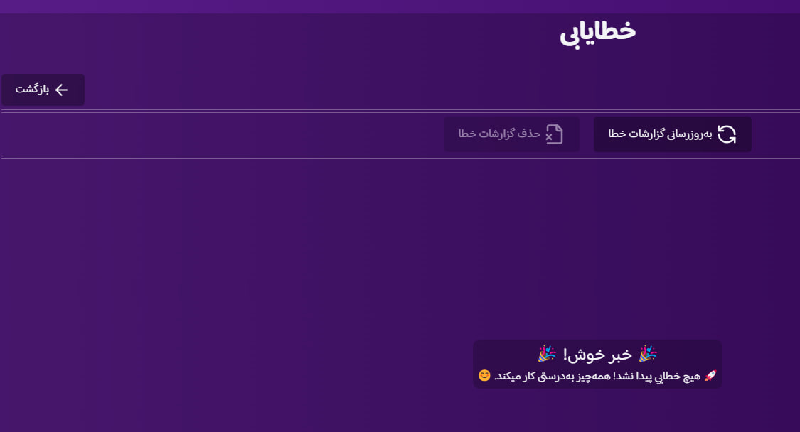

### نمای کلی
پنل عیب‌یابی ابزارهایی برای شناسایی و رفع مشکلات افزونه ارائه می‌دهد. به مدیران وب‌سایت امکان می‌دهد لاگ‌های خطا را به طور کارآمد نظارت، تحلیل و مدیریت کنند.

### هشدار مهم:
- برای دسترسی به این پنل باید مجوز "عیب‌یابی" را داشته باشید
- دسترسی به لاگ‌های خطا برای مدیران وب‌سایت جهت عیب‌یابی مشکلات ضروری است

### دسترسی به پنل
پنل عیب‌یابی از طریق زیر قابل دسترسی است:
1. تنظیمات افزونه Doorbin
2. از دکمه "بازگشت" برای برگشت به تنظیمات اصلی Doorbin استفاده کنید

### ویژگی‌های کنترلی

#### مدیریت لاگ خطا
- بازخوانی لاگ‌های خطا
  - نمایش را برای نشان دادن هر لاگ خطای جدید به‌روز می‌کند
  - وضعیت بلادرنگ عملیات‌های افزونه را ارائه می‌دهد
  - به طور منظم برای نظارت بر سلامت سیستم استفاده کنید
- حذف لاگ‌های خطا
  - فقط زمانی که لاگ‌های خطا وجود دارند فعال می‌شود
  - پس از رفع مشکلات، لاگ‌های خطای فعلی را حذف می‌کند
  - به حفظ لاگ‌های تمیز و خوانا کمک می‌کند
  - توصیه می‌شود پس از تأیید رفع مشکلات استفاده شود

### نمایش وضعیت
پنل یکی از دو حالت زیر را نشان می‌دهد:
1. زمانی که خطاها وجود دارند:
   - لاگ‌های خطای دقیق را نمایش می‌دهد
   - زمان و جزئیات خطا را نشان می‌دهد
   - دکمه حذف لاگ‌های خطا را فعال می‌کند

2. زمانی که خطایی وجود ندارد:
   - پیام موفقیت را نمایش می‌دهد: "🎉 خبر خوش! 🎉🚀 هیچ خطایی پیدا نشد! همه‌چیز به‌درستی کار میکند. 😊"
   - دکمه حذف لاگ‌های خطا غیرفعال باقی می‌ماند

### بهترین شیوه‌های کارایی
1. به طور منظم لاگ‌های خطا را بررسی کنید
2. راه‌حل‌های مشکلات تکراری را مستند کنید
3. لاگ‌های خطای رفع شده را فوراً پاک کنید
4. الگوهای وقوع خطا را نظارت کنید
5. تا زمان رفع کامل مشکلات، لاگ‌های خطا را برای مراجعه نگه دارید

### نکات
نظارت منظم به جلوگیری از مشکلات جدی کمک می‌کند
قبل از حذف، از گزارش‌های خطای مهم نسخه پشتیبان تهیه کنید
از گزارش‌های خطا برای بهبود پیکربندی افزونه استفاده کنید
هنگام توسعه، الگوهای خطا را در نظر بگیرید

## 8. جعبه متای همگام سازی محصول

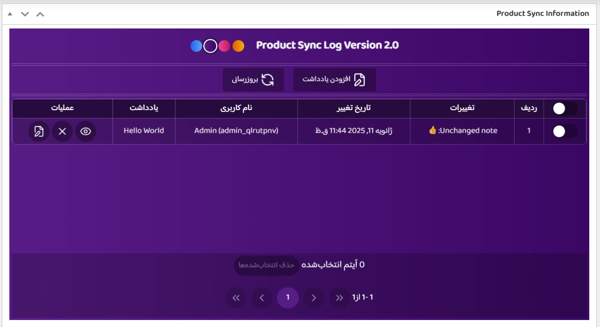

### نمای کلی
جعبه متای همگام‌سازی محصول، قابلیت ردیابی و مدیریت تغییرات دقیق را در صفحه ویرایش محصول ووکامرس فراهم می‌کند. این به کاربران اجازه می‌دهد تا تغییرات محصول را به طور موثر مشاهده، مدیریت و مستند کنند.

### دستورالعمل‌های دسترسی
1. به بخش محصولات -> همه محصولات در ووکامرس بروید
2. یک محصول را ویرایش کنید (فرمت URL: yoursite/wp-admin/post.php?post=[product_code]&action=edit)
3. جعبه متای همگام‌سازی محصول را در صفحه پیدا کنید
4. از منوی نقاط برای سفارشی‌سازی تم رنگی رابط کاربری استفاده کنید

### مجوزهای مورد نیاز
برای دسترسی به ویژگی‌های جعبه متا، به مجوزهای زیر نیاز دارید:
- مشاهده ردیف‌ها: دسترسی برای مشاهده گزارش‌ها در جعبه متا
- افزودن یادداشت: توانایی افزودن یادداشت به تغییرات
- حذف ردیف‌ها: مجوز حذف گزارش‌ها
- ویرایش یادداشت‌های سایر کاربران: اختیار تغییر یادداشت‌های ایجاد شده توسط سایر کاربران

نکته: ویژگی‌ها بر اساس مجوزهای از دست رفته محدود خواهند شد

### ویژگی‌های کنترلی

#### مدیریت یادداشت
- افزودن یادداشت‌ها
  - حتی بدون تغییرات در دسترس است
  - حداکثر 200 کاراکتر برای هر یادداشت
  - برای باز کردن کادر گفتگو کلیک کنید
  - برای ذخیره روی "به‌روزرسانی یادداشت" کلیک کنید
  - منتظر تایید به‌روزرسانی گزارش بمانید

#### عملکرد تازه‌سازی
- گزارش‌ها را بدون تازه‌سازی صفحه به‌روز می‌کند
- به‌ویژه برای به‌روزرسانی‌های محصولات متغیر مفید است
- وضعیت فعلی صفحه را حفظ می‌کند

### اجزای رابط کاربری

#### ساختار جدول

##### بخش سرصفحه
- چک‌باکس انتخاب گروهی
- کنترل‌های عملیات

##### ستون‌های داده
- چک‌باکس انتخاب
- شماره ردیف
- تغییرات (مقادیر قبلی/جدید)
- تاریخ تغییر
- نام کاربری (با نام نمایشی)
- یادداشت‌ها
- دکمه‌های عملیات

##### دکمه‌های عملیات
1. دکمه چشم
   - جزئیات کامل ردیف را نشان می‌دهد
   - پنجره مشاهده جزئیات را باز می‌کند

2. آیکون ضربدر
   - ردیف فعلی را حذف می‌کند
   - نیاز به تایید دارد

3. آیکون یادداشت
   - یادداشت‌ها را به‌روز می‌کند
   - توسط مجوزها محدود شده است

##### بخش پاورقی
- کنترل‌های صفحه‌بندی
- نمایش تعداد نتایج
- کنترل‌های عملیات گروهی

### مدیریت داده‌ها

#### عملیات‌های فردی
- حذف‌های مخصوص ردیف
- به‌روزرسانی یادداشت‌ها
- مشاهده جزئیات

#### عملیات‌های گروهی
- انتخاب چند ردیف
- حذف‌های دسته‌ای
- نیاز به تایید دارد
- دسترسی بر اساس مجوز

### بهترین شیوه‌های کارایی
1. بررسی منظم گزارش‌ها
2. ایجاد یادداشت‌های معنی‌دار
3. استفاده دقیق از عملیات گروهی
4. تایید مجوز قبل از انجام عملیات
5. تازه‌سازی منظم برای داده‌های جاری

### نکات
- گسترش متن با حرکت موس روی آن
- نیاز به تایید برای حذف‌ها
- ویرایش یادداشت توسط مجوزها محدود شده است
- عملیات گروهی نیاز به دقت دارد